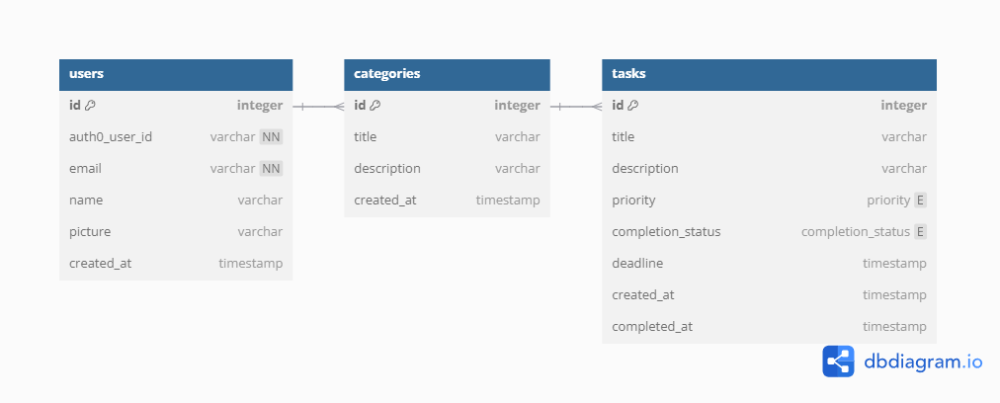

# ES - Individual Project

## Description
This project revolves around the creation of a simple To-Do list application, while applying the concepts of agile software development and using AWS for deployment.

## Technologies
- **Frontend**: Next.js
- **Backend**: SpringBoot
- **Database**: PostgreSQL
- **Deployment**: AWS

## Data Model
The data model is composed of three entities: 'User', 'Task' and 'Category'.

## Made By
**Alexandre Pedro Ribeiro** - **108122**